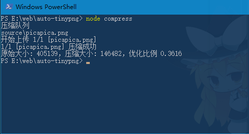

# tinypng.com 熊猫压缩 自动化脚本

自动上传sourcess内的`png/jpg`到 tinypng.com进行压缩，支持递归文件夹。  
模拟浏览器行为,不需要注册 API key 适合少量图片(一次性压过40+,没试上限是多少。

## 用法
1. 需要node环境
2. 把要压缩的文件/文件夹放到source文件夹内
3. 运行compress.js
4. 压缩后的文件在output文件夹
## PS
只能压缩`5M以内`的`png/jpg` tinypng定的(⊙ω⊙)  
压不了的其他文件会原样复制到output文件夹内.  
  
感谢[@zhanyuzhang](https://www.shuzhiduo.com/A/RnJWyXXydq/)提供随机IP思路